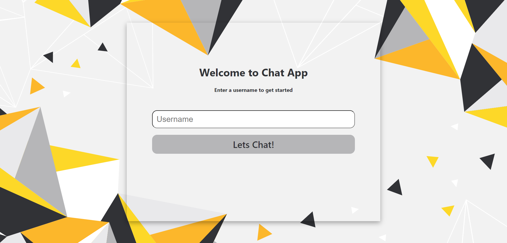
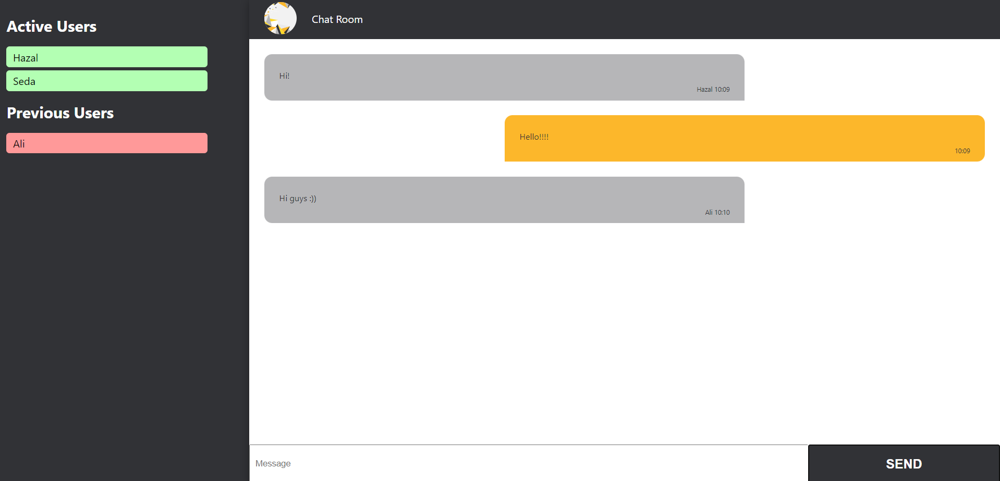

# Chat App

This is a real-time chat application that enables instant communication between users. It is built using React, Node.js, and socket.io.

## Features

- Users can login to the application with username they enter.
- Users can join the general chat room and communicate with other users.
- Users can see the status of other users in the user list and chat history.
- Messages are automatically updated in real-time, allowing users to communicate instantly.

## Requirements

- Node.js (version 10 or above)
- React (version 16 or above)
- socket.io (version 4 or above)

## Installation

1. Clone this repository:

   ```bash
   git clone https://github.com/hazhan6/chat-app.git

   ```

2. Go to the client directory:

   ```bash
   cd chat-app/client

   ```

3. Install the dependencies:

   ```bash
   npm install

   ```

4. Go to the server directory:

   ```bash
   cd ../server

   ```

5. Install the dependencies:

   ```bash
   npm install

   ```

6. Start the server:

   ```bash
   npm start

   ```

7. Start the client:

   ```bash
   npm start

   ```

8. Go to http://localhost:3000 in your browser and start using the chat application.

## Screenshots

Here are some screenshots of the Chat App:





## Contributing

Welcome contributions! Please open a Pull Request for improvements, suggestions, and adding new features.

Fork this repository to your GitHub account.
Create a new branch for adding new features, fixing bugs, or making improvements.
Commit your changes (git commit -am 'Add new feature').
Push to your forked repository (git push origin new-feature).
Open a Pull Request to this repository.
